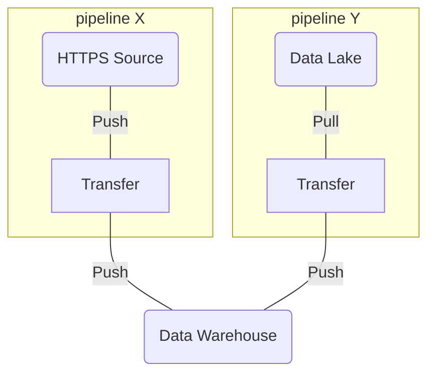
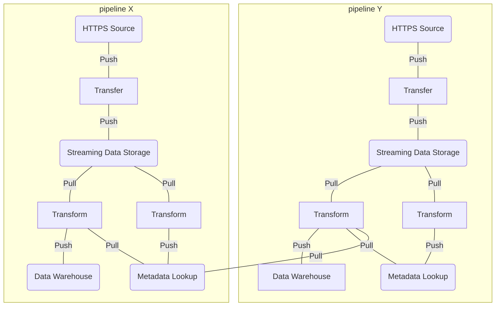

# Substation

Substation is a cloud native data pipeline toolkit.

## What is Substation?

Substation is a modular ingest, transform, load (ITL) application for moving data between distributed systems. Originally designed to collect, normalize, and enrich security event data, the application provides methods for achieving [high quality data](https://en.wikipedia.org/wiki/Data_quality#Definitions) through interconnected data pipelines.

Substation also provides Go packages for filtering and modifying JSON data.

### Features

As an event-driven ITL application, Substation has these features:

- real-time event filtering and processing
- cross-dataset event correlation and enrichment
- concurrent event routing to downstream systems
- runs on containers, built for extensibility
  - support for new event filters and processors
  - support for new ingest sources and load destinations
  - supports creation of custom applications (e.g., multi-cloud)

As a package, Substation has these features:

- [evaluate and filter JSON objects](condition/)
- [modify data from, to, and in-place as JSON objects](process/)

### Use Cases

Substation was originally designed to support the mission of achieving high quality data for threat hunting, threat detection, and incident response, but it can be used to move data between many distributed systems and services. Here are some example use cases:

- data availability: sink data to an intermediary streaming service such as AWS Kinesis, then concurrently sink it to a data lake, data warehouse, and SIEM
- data consistency: normalize data across every dataset using a permissive schema such as the [Elastic Common Schema](https://www.elastic.co/guide/en/ecs/current/index.html)
- data completeness: enrich data by integrating AWS Lambda functions and building self-populating AWS DynamoDB tables for low latency, real-time event context

### Example Data Pipelines

#### Simple

The simplest data pipeline is one with a single source (ingest), a single transform, and a single sink (load). The diagram below shows pipelines that ingest data from different sources and sink it unmodified to a data warehouse where it can be used for analysis.



#### Complex

The complexity of a data pipeline, including its features and how it connects with other pipelines, is up to the user. The diagram below shows two complex data pipelines that have these feature:

- both pipelines write unmodified data to intermediary streaming data storage (e.g., AWS Kinesis) to support concurrent consumers and downstream systems
- both pipelines transform data by enriching it from their own inter-pipeline metadata lookup (e.g., AWS DynamoDB)
- pipeline Y additionally transforms data by enriching it from pipeline X's metadata lookup




As a toolkit, Substation makes no assumptions about how data pipelines are configured and connected. We encourage experimentation and outside-the-box thinking when it comes to pipeline design!

## Quickstart

Users can use the steps below to test Substation's functionality. We recommend doing the steps below in a Docker container (we've included [Visual Studio Code configurations](https://code.visualstudio.com/docs/remote/containers) for developing and testing Substation in `.devcontainer/` and `.vscode/`).

### Step 1: Compile the File Binary

From the project root, run the commands below to compile the Substation `file` app.

```bash
$ cd cmd/file/substation/
$ go build .
$ ./substation -h
```

### Step 2: Compile the quickstart Configuration File

From the project root, run the commands below to compile the [quickstart Jsonnet configuration files](configs/quickstart) into a Substation JSON config.

```bash
$ sh build/config/compile.sh
```

### Step 3: Test Substation

From the project root, run the commands below to create a sample events file and test Substation. After this, we recommend reviewing the [configs](configs/) documentation and running more tests with other event processors to learn how the app works.

```bash
$ echo '{"hello":"world"}' >> quickstart.json
$ ./cmd/file/substation/substation -input quickstart.json -config configs/quickstart/config.json
```

### Step 4: Test Substation in AWS

Navigate to the [build](build/) directory and review the `terraform`, `container`, and `config` documentation. [build/terraform/aws/](build/terraform/aws/) contains a fully-featured data pipeline that can be used as an example of how to deploy pipelines in AWS.

## Additional Documentation

More documentation about Substation can be found across the project, including:

- [Configuration Syntax](configs/)
- [Deploying to AWS](build/terraform/aws/)
- [Using Conditions to Evaluate JSON Objects](condition/)
- [Using Processors to Modify JSON Objects](process/)

## Licensing

Substation and its associated code is released under the terms of the [MIT License](LICENSE).
