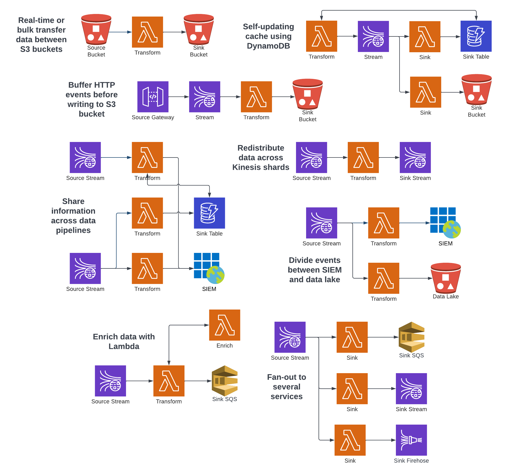

# Substation

<p align="center">

</p>

<p align="center">
Substation is a cloud-native, event-driven data pipeline and transformation toolkit designed for security use cases.
</p>

## Resources

* <a href="https://substation.readme.io/docs" target="_blank">Documentation</a>
* <a href="https://github.com/brexhq/substation/discussions/categories/announcements" target="_blank">Announcements</a>
* <a href="https://medium.com/brexeng/announcing-substation-188d049d979b" target="_blank">Announcement Post</a>

## Features

Substation provides three unique capabilities:

* Deploy modular, serverless data pipelines in minutes
  * Design pipelines based on your unique use cases and requirements
  * Autoscale beyond 100,000 events per second with almost zero maintenance
  * Route data to SIEMs, data lakes, and other security platforms
* Inspect, normalize, and enrich event logs in real-time
  * Inspect data before applying transformation functions and routing decisions
  * Normalize data into a common schema for easy analysis and correlation
  * Enrich data with threat, infrastructure, and business context
* Create custom data processing applications written in Go
  * Build Substation applications that run in any cloud environment or on-prem 
  * Use Substation's Go packages to inspect and transform data in your own applications
  
## Getting Started

* <a href="https://substation.readme.io/recipes/1-minute-quickstart" target="_blank">Download, build, and test Substation in under 1 minute</a>
* <a href="https://substation.readme.io/recipes/deploying-aws-pipelines" target="_blank">Deploy Substation to your AWS account</a>
* <a href="https://substation.run/" target="_blank">Learn about Substation's data transformation features in your browser</a>

## Substation Explained

Substation transforms event logs like this ...

```json
{
  "ts": 1591367999.305988,
  "uid": "CMdzit1AMNsmfAIiQc",
  "id.orig_h": "192.168.4.76",
  "id.orig_p": 36844,
  "id.resp_h": "192.168.4.1",
  "id.resp_p": 53,
  "proto": "udp",
  "service": "dns",
  "duration": 0.06685185432434082,
  "orig_bytes": 62,
  "resp_bytes": 141,
  "conn_state": "SF",
  "missed_bytes": 0,
  "history": "Dd",
  "orig_pkts": 2,
  "orig_ip_bytes": 118,
  "resp_pkts": 2,
  "resp_ip_bytes": 197
}
{
  "ts": 1591367999.430166,
  "uid": "C5bLoe2Mvxqhawzqqd",
  "id.orig_h": "192.168.4.76",
  "id.orig_p": 46378,
  "id.resp_h": "31.3.245.133",
  "id.resp_p": 80,
  "proto": "tcp",
  "service": "http",
  "duration": 0.25411510467529297,
  "orig_bytes": 77,
  "resp_bytes": 295,
  "conn_state": "SF",
  "missed_bytes": 0,
  "history": "ShADadFf",
  "orig_pkts": 6,
  "orig_ip_bytes": 397,
  "resp_pkts": 4,
  "resp_ip_bytes": 511
}
```

... into this ...

```json
{
  "event": {
    "original": {
      "ts": 1591367999.305988,
      "uid": "CMdzit1AMNsmfAIiQc",
      "id.orig_h": "192.168.4.76",
      "id.orig_p": 36844,
      "id.resp_h": "192.168.4.1",
      "id.resp_p": 53,
      "proto": "udp",
      "service": "dns",
      "duration": 0.06685185432434082,
      "orig_bytes": 62,
      "resp_bytes": 141,
      "conn_state": "SF",
      "missed_bytes": 0,
      "history": "Dd",
      "orig_pkts": 2,
      "orig_ip_bytes": 118,
      "resp_pkts": 2,
      "resp_ip_bytes": 197
    },
    "hash": "7ed38f773271e700e2d55984a2ba7902be9ec8c2922e52fc7558aeade425c3de",
    "created": "2022-12-30T17:20:41.027457Z",
    "id": "CMdzit1AMNsmfAIiQc",
    "kind": "event",
    "category": [
      "network"
    ],
    "action": "network-connection",
    "outcome": "success",
    "duration": 66851854.32434082
  },
  "@timestamp": "2020-06-05T14:39:59.305988Z",
  "client": {
    "address": "192.168.4.76",
    "ip": "192.168.4.76",
    "port": 36844,
    "packets": 2,
    "bytes": 62
  },
  "server": {
    "address": "192.168.4.1",
    "ip": "192.168.4.1",
    "port": 53,
    "packets": 2,
    "bytes": 141
  },
  "network": {
    "protocol": "udp",
    "bytes": 203,
    "packets": 4,
    "direction": "internal"
  }
}
{
  "event": {
    "original": {
      "ts": 1591367999.430166,
      "uid": "C5bLoe2Mvxqhawzqqd",
      "id.orig_h": "192.168.4.76",
      "id.orig_p": 46378,
      "id.resp_h": "31.3.245.133",
      "id.resp_p": 80,
      "proto": "tcp",
      "service": "http",
      "duration": 0.25411510467529297,
      "orig_bytes": 77,
      "resp_bytes": 295,
      "conn_state": "SF",
      "missed_bytes": 0,
      "history": "ShADadFf",
      "orig_pkts": 6,
      "orig_ip_bytes": 397,
      "resp_pkts": 4,
      "resp_ip_bytes": 511
    },
    "hash": "af70ea0b38e1fb529e230d3eca6badd54cd6a080d7fcb909cac4ee0191bb788f",
    "created": "2022-12-30T17:20:41.027505Z",
    "id": "C5bLoe2Mvxqhawzqqd",
    "kind": "event",
    "category": [
      "network"
    ],
    "action": "network-connection",
    "outcome": "success",
    "duration": 254115104.67529297
  },
  "@timestamp": "2020-06-05T14:39:59.430166Z",
  "client": {
    "address": "192.168.4.76",
    "ip": "192.168.4.76",
    "port": 46378,
    "packets": 6,
    "bytes": 77
  },
  "server": {
    "address": "31.3.245.133",
    "ip": "31.3.245.133",
    "port": 80,
    "packets": 4,
    "bytes": 295,
    "domain": "h31-3-245-133.host.redstation.co.uk",
    "top_level_domain": "co.uk",
    "subdomain": "h31-3-245-133.host",
    "registered_domain": "redstation.co.uk",
    "as": {
      "number": 20860,
      "organization": {
        "name": "Iomart Cloud Services Limited"
      }
    },
    "geo": {
      "continent_name": "Europe",
      "country_name": "United Kingdom",
      "city_name": "Manchester",
      "location": {
        "latitude": 53.5039,
        "longitude": -2.1959
      },
      "accuracy": 1000
    }
  },
  "network": {
    "protocol": "tcp",
    "bytes": 372,
    "packets": 10,
    "direction": "outbound"
  }
}
```

... using this ...

```jsonnet
local sub = import 'substation.libsonnet';

local event = import 'event.libsonnet';
local client = import 'client.libsonnet';
local server = import 'server.libsonnet';
local network = import 'network.libsonnet';

{
  sink: sub.interfaces.sink.stdout,
  transform: {
    type: 'batch',
    settings: {
      processors:
        event.processors
        + client.processors
        + server.processors
        + network.processors
    },
  },
}
```

... running in any data pipeline like these ...



## Licensing

Substation and its associated code is released under the terms of the [MIT License](LICENSE).

<!-- Keywords: go, golang, aws, kinesis, lambda, dynamodb, kafka, siem, data lake, cribl, cribl.io, tarsal, tarsal.co, datadog, datadoghq.com, confluent, confluent.io, elastic, logstash, filebeat, elastic.co, fluent, fluentd, fluentd.org, mezmo, mezmo.com -->
