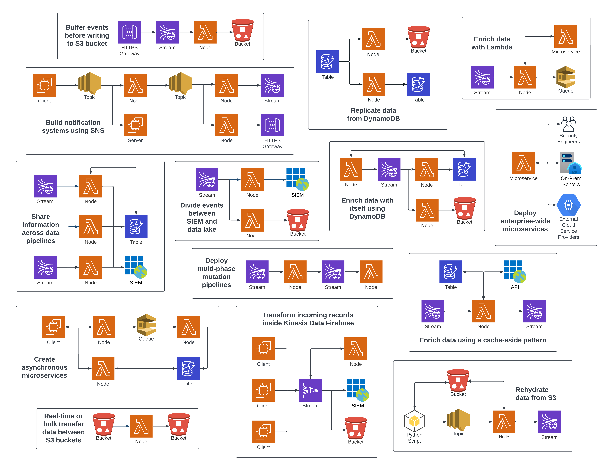

# Substation


<p align="center">Substation is a cloud-native, event-driven data pipeline toolkit built for security teams.</p>

<div align="center">

[Releases][releases]&nbsp;&nbsp;&nbsp;|&nbsp;&nbsp;&nbsp;[Docs][docs]&nbsp;&nbsp;&nbsp;|&nbsp;&nbsp;&nbsp;[Quickstart][quickstart]&nbsp;&nbsp;&nbsp;|&nbsp;&nbsp;&nbsp;[Announcement Post (2022)][announcement]

</div>

## At a Glance

Substation is inspired by data pipeline systems like Logstash and Fluentd, but is built for modern security teams:

- **Extensible Data Processing**: Build data processing pipeline systems and microservices using out-of-the-box applications and 100+ data transformation functions, or create your own written in Go.
- **Route Data Across the Cloud**: Conditionally route data to, from, and between AWS cloud services, including S3, Kinesis, SQS, and Lambda, or to any HTTP endpoint.
- **Bring Your Own Schema**: Format, normalize, and enrich event logs to comply with the Elastic Common Schema (ECS), Open Cybersecurity Schema Framework (OCSF), or any other schema.
- **Unlimited Data Enrichment**: Use external APIs to enrich event logs affordably and at scale with enterprise and threat intelligence, or build a microservice that reduces spend in expensive security APIs.
- **No Servers, No Maintenance**: Deploys as a serverless application in your AWS account, launches in minutes using Terraform, and requires no maintenance after deployment.
- **Runs Almost Anywhere**: Create applications that run on most platforms supported by Go and transform data consistently across laptops, servers, containers, and serverless functions.
- **High Performance, Low Cost**: Transform 100,000+ events per second while keeping cloud costs as low as a few cents per GB. Vendor solutions, like [Cribl](https://cribl.io/cribl-pricing/) and [Datadog](https://www.datadoghq.com/pricing/?product=observability-pipelines#products), can cost up to 10x more.

All of these data pipeline and microservice systems, and many more, can be built with Substation:



## Getting Started

You can run Substation on these platforms:

- [Docker](https://substation.readme.io/v1.0.0/docs/try-substation-on-docker)
- [macOS / Linux](https://substation.readme.io/v1.0.0/docs/try-substation-on-macos-linux)
- [AWS](https://substation.readme.io/v1.0.0/docs/try-substation-on-aws)

The project includes a Makefile that simplifies local development and test deployments. To test the system in AWS, run this from the project root:

```sh
# Checks that dependencies are installed and environment variables are set.
make check
# Deploys Substation to AWS. This deploys the Kinesis Time Travel example 
# and writes data to the Kinesis stream.
make test-aws
```

The [AWS examples](examples/terraform/aws) folder contains reusable deployment patterns that demonstrate best practices for managing the system using [Terraform](https://www.terraform.io/) and [Jsonnet](https://jsonnet.org/). Deploy them using these commands:

```sh
make check
# Builds dependencies required for AWS deployments.
make build-aws
# Deploys the DynamoDB Change Data Capture example.
make deploy-aws DEPLOYMENT_DIR=examples/terraform/aws/dynamodb/cdc AWS_APPCONFIG_ENV=example
```

**We do not recommend managing cloud deployments from a local machine using the Makefile. Production deployments should use a CI/CD pipeline with a remote state backend to manage infrastructure.**

## Transforming Event Logs

Substation excels at formatting, normalizing, and enriching event logs. For example, Zeek connection logs can be transformed to comply with the Elastic Common Schema:

<table>
<tr>
<th><code>Raw Event</code></th>
<th><code>Transformed Event</code></th>
</tr>
<tr>
<td>

```json
{
  "ts": 1591367999.430166,
  "uid": "C5bLoe2Mvxqhawzqqd",
  "id.orig_h": "192.168.4.76",
  "id.orig_p": 46378,
  "id.resp_h": "31.3.245.133",
  "id.resp_p": 80,
  "proto": "tcp",
  "service": "http",
  "duration": 0.25411510467529297,
  "orig_bytes": 77,
  "resp_bytes": 295,
  "conn_state": "SF",
  "missed_bytes": 0,
  "history": "ShADadFf",
  "orig_pkts": 6,
  "orig_ip_bytes": 397,
  "resp_pkts": 4,
  "resp_ip_bytes": 511
}
```
</td>
<td>

```json
{
  "event": {
    "original": {
      "ts": 1591367999.430166,
      "uid": "C5bLoe2Mvxqhawzqqd",
      "id.orig_h": "192.168.4.76",
      "id.orig_p": 46378,
      "id.resp_h": "31.3.245.133",
      "id.resp_p": 80,
      "proto": "tcp",
      "service": "http",
      "duration": 0.25411510467529297,
      "orig_bytes": 77,
      "resp_bytes": 295,
      "conn_state": "SF",
      "missed_bytes": 0,
      "history": "ShADadFf",
      "orig_pkts": 6,
      "orig_ip_bytes": 397,
      "resp_pkts": 4,
      "resp_ip_bytes": 511
    },
    "hash": "af70ea0b38e1fb529e230d3eca6badd54cd6a080d7fcb909cac4ee0191bb788f",
    "created": "2022-12-30T17:20:41.027505Z",
    "id": "C5bLoe2Mvxqhawzqqd",
    "kind": "event",
    "category": [
      "network"
    ],
    "action": "network-connection",
    "outcome": "success",
    "duration": 254115104.675293
  },
  "@timestamp": "2020-06-05T14:39:59.430166Z",
  "client": {
    "address": "192.168.4.76",
    "ip": "192.168.4.76",
    "port": 46378,
    "packets": 6,
    "bytes": 77
  },
  "server": {
    "address": "31.3.245.133",
    "ip": "31.3.245.133",
    "port": 80,
    "packets": 4,
    "bytes": 295,
    "domain": "h31-3-245-133.host.redstation.co.uk",
    "top_level_domain": "co.uk",
    "subdomain": "h31-3-245-133.host",
    "registered_domain": "redstation.co.uk",
    "as": {
      "number": 20860,
      "organization": {
        "name": "Iomart Cloud Services Limited"
      }
    },
    "geo": {
      "continent_name": "Europe",
      "country_name": "United Kingdom",
      "city_name": "Manchester",
      "location": {
        "latitude": 53.5039,
        "longitude": -2.1959
      },
      "accuracy": 1000
    }
  },
  "network": {
    "protocol": "tcp",
    "bytes": 372,
    "packets": 10,
    "direction": "outbound"
  }
}
```
</td>
</tr>
</table>

## Routing Data

Substation can route data to several destinations from a single process and, unlike most other data pipeline systems,
data transformation and routing are functionally equivalent -- this means that data can be transformed or routed in any order.

In this configuration, data is: 

- Written to AWS S3
- Printed to stdout
- Conditionally dropped (filtered, removed)
- Sent to an HTTPS endpoint

```jsonnet
// The input is a JSON array of objects, such as:
// [
//   { "field1": "a", "field2": 1, "field3": true },
//   { "field1": "b", "field2": 2, "field3": false },
//   ...
// ]
local sub = import 'substation.libsonnet';

// This filters events based on the value of field3.
local is_false = sub.cnd.str.eq(settings={ object: { source_key: 'field3' }, value: 'false' });

{
  transforms: [
    // Pre-transformed data is written to an object in AWS S3 for long-term storage.
    sub.tf.send.aws.s3(settings={ bucket_name: 'example-bucket-name' }),
    // The JSON array is split into individual events that go through 
    // the remaining transforms. Each event is printed to stdout.
    sub.tf.agg.from.array(),
    sub.tf.send.stdout(),
    // Events where field3 is false are removed from the pipeline.
    sub.pattern.tf.conditional(condition=is_false, transform=sub.tf.util.drop()),
    // The remaining events are sent to an HTTPS endpoint.
    sub.tf.send.http.post(settings={ url: 'https://example-http-endpoint.com' }),
  ],
}
```

Alternatively, the data can be conditionally routed to different destinations:

```jsonnet
local sub = import 'substation.libsonnet';

{
  transforms: [
    // If field3 is false, then the event is sent to an HTTPS endpoint; otherwise,
    // the event is written to an object in AWS S3.
    sub.tf.meta.switch(settings={ cases: [
      {
        condition: sub.cnd.any(sub.cnd.str.eq(settings={ object: { source_key: 'field3' }, value: 'false' })),
        transform: sub.tf.send.http.post(settings={ url: 'https://example-http-endpoint.com' }),
      },
      {
        transform: sub.tf.send.aws.s3(settings={ bucket_name: 'example-bucket-name' }),
      },
    ] }),
    // The event is always available to any remaining transforms.
    sub.tf.send.stdout(),
  ],
}
```

## Configuring Applications

Substation applications run almost anywhere (laptops, servers, containers, serverless functions) and all transform functions behave identically regardless of where they are run. This makes it easy to develop configuration changes locally, validate them in a build (CI/CD) pipeline, and run integration tests in a staging environment before deploying to production.

Configurations are written in Jsonnet and can be expressed as functional code, simplifying version control and making it easy to build custom data processing libraries. For power users, configurations also have abbreviations that make them easier to write. Compare the configuration below to similar configurations for Logstash and Fluentd:

<table>
<tr>
<th><code>Substation</code></th>
<th><code>Logstash</code></th>
<th><code>Fluentd</code></th>
</tr>
<tr>
<td>

```jsonnet
local sub = import 'substation.libsonnet';

{
  transforms: [
    sub.tf.obj.cp(
      settings={ object: { source_key: 'src_field_1', target_key: 'dest_field_1' } }
    ),
    sub.tf.obj.cp({ obj: { src: 'src_field_2', trg: 'dest_field_2' } }),
    sub.tf.send.stdout(),
    sub.tf.send.http.post(
      settings={ url: 'https://example-http-endpoint.com' }
    ),
  ],
}
```
</td>
<td>

```ruby
input {
  file {
    path => "/path/to/your/file.log"
    start_position => "beginning"
    sincedb_path => "/dev/null"
    codec => "json"
  }
}

filter {
  json {
    source => "message"
  }

  mutate {
    copy => { "src_field_1" => "dest_field_1" }
    copy => { "src_field_2" => "dest_field_2" }
  }
}

output {
  stdout {
    codec => rubydebug
  }

  http {
    url => "https://example-http-endpoint.com"
    http_method => "post"
    format => "json"
  }
}
```
</td>
<td>

```xml
<source>
  @type tail
  path /path/to/your/file.log
  pos_file /dev/null
  tag file.log
  format json
</source>

<filter file.log>
  @type record_transformer
  enable_ruby
  <record>
    dest_field_1 ${record['src_field_1']}
    dest_field_2 ${record['src_field_2']}
  </record>
</filter>

<match file.log>
  @type copy
  <store>
    @type stdout
  </store>
  <store>
    @type http
    url https://example-http-endpoint.com
    http_method post
    <format>
      @type json
    </format>
  </store>
</match>
```
</td>
</tr>
</table>

## Deploying to AWS

Substation includes Terraform modules for securely deploying data pipelines and microservices in AWS. These modules are designed for ease of use, but are also flexible enough to support managing complex systems. This configuration deploys a data pipeline that is capable of receiving data from API Gateway and storing it in an S3 bucket:

<table>
<tr>
<th><code>resources.tf</code></th>
<th><code>node.tf</code></th>
</tr>
<tr>
<td>

```tcl
# These resources are deployed once and are used by all Substation infrastructure.

# Substation resources can be encrypted using a customer-managed KMS key.
module "kms" {
  source = "build/terraform/aws/kms"

  config = {
    name   = "alias/substation"
  }
}

# Substation typically uses AppConfig to manage configuration files, but
# configurations can also be loaded from an S3 URI or an HTTP endpoint.
module "appconfig" {
  source = "build/terraform/aws/appconfig"

  config = {
    name = "substation"
    environments = [{
        name = "example"
    }]
  }
}

module "ecr" {
  source = "build/terraform/aws/ecr"
  kms    = module.kms

  config = {
    name         = "substation"
    force_delete = true
  }
}

resource "random_uuid" "s3" {}

module "s3" {
  source = "build/terraform/aws/s3"
  kms    = module.kms

  config = {
    # Bucket name is randomized to avoid collisions.
    name = "${random_uuid.s3.result}-substation"
  }

  # Access is granted by providing the role name of a
  # resource. This access applies least privilege and
  # grants access to dependent resources, such as KMS.
  access = [
    # Lambda functions create unique roles that are
    # used to access resources.
    module.node.role.name,
  ]
}
```
</td>
<td>

```tcl
# Deploys an unauthenticated API Gateway that forwards data to the node.
module "node_gateway" {
  source = "build/terraform/aws/api_gateway/lambda"
  lambda = module.node

  config = {
    name = "node_gateway"
  }

  depends_on = [
    module.node
  ]
}

module "node" {
  source = "build/terraform/aws/lambda"
  kms       = module.kms  # Optional
  appconfig = module.appconfig  # Optional

  config = {
    name        = "node"
    description = "Substation node that writes data to S3."
    image_uri   = "${module.ecr.url}:latest"
    image_arm   = true

    env = {
      "SUBSTATION_CONFIG" : "https://localhost:2772/applications/substation/environments/example/configurations/node"
      "SUBSTATION_DEBUG" : true
      # This Substation node will ingest data from API Gateway. More nodes can be 
      # deployed to ingest data from other sources, such as Kinesis or SQS.
      "SUBSTATION_LAMBDA_HANDLER" : "AWS_API_GATEWAY"
    }
  }

  depends_on = [
    module.appconfig.name,
    module.ecr.url,
  ]
}
```
</td>
</tr>
</table>


## Licensing

Substation and its associated code is released under the terms of the [MIT License](LICENSE).

<!--Links-->
[releases]:https://github.com/brexhq/substation/releases "Substation Releases"
[docs]:https://substation.readme.io/docs "Substation Documentation"
[quickstart]:https://substation.readme.io/recipes/1-minute-quickstart "Substation Quickstart"
[announcement]:https://medium.com/brexeng/announcing-substation-188d049d979b "Substation Announcement Post"
