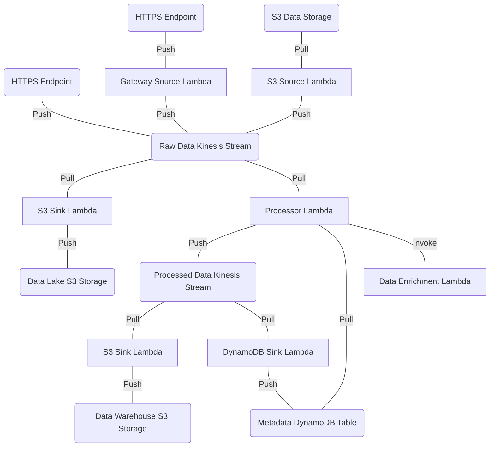

# terraform

This directory contains Terraform configuration files for deploying Substation to AWS.

## Using Terraform

An overview on how Terraform is used and the write, plan, apply workflow is available [here](https://www.terraform.io/intro).

Please use the official [Terraform documentation](https://registry.terraform.io/providers/hashicorp/aws/latest/docs) for further details on using Terraform to deploy AWS applications or for boiler plate examples.

## Configurations

### bootstrap.tf

This file acts as a deployment bootstrap and includes the following:

- creation of a deployment-wide KMS key
- creation of a deployment-wide AppConfig application with "prod" and "dev" environments
- creation of an "instant deployment" strategy for AppConfig
- creation of the AWS Lambda Substation ECR image repository
- creation of the AWS Lambda autoscaling ECR image repository

There are a few things to be aware of when running a fresh deployment:

- Terraform does not manage the build and deployment of container images; after the image repositories are created, then container build and upload should happen externally via Docker (see `build/container/aws/` for more information)
- Terraform does not manage the application configurations; after the AppConfig application is created, then hosted configurations should be compiled and uploaded (see `build/config/` for more information)
  - As a best practice, we recommend using the "prod" environment for production data pipelines and the "dev" environment for development data pipelines
- "instant deployment" is useful for immediately deploying net-new data pipelines

### xray.tf

Substation Lambdas use AWS X-Ray for performance monitoring and tuning. If the AWS account's X-Ray data is not encrypted, then the `xray.tf` file can be used to setup encryption. The ARN produced by `xray_key` (or the ARN of a previously created encryption key) must be added as a kms_read and kms_write resources on all Lambda IAM policies. Alternatively, if no encryption is wanted, then exclude this file and any references to the `xray_key` ARN from Lambda IAM policies.

Read more about AWS X-Ray [here](https://aws.amazon.com/xray/).

### autoscaling.tf

This file includes everything required to deploy the AWS Lambda autoscaling application (`cmd/aws/lambda/autoscaling`). This is required for any data pipelines that use Kinesis Data Streams.

### example_*.tf

These files include a fully-featured data pipeline that makes use of every Substation component as an example of a "best practice" deployment. This includes:

- ingest data from an S3 bucket
- ingest data from multiple API Gateways
- raw Kinesis stream for storage and access to unmodified, pre-processed data
- processed Kinesis stream for storage and access to transformed, processed data
- data processor Lambda that reads from the raw Kinesis stream, processes data, and writes to the processed Kinesis stream
- load raw data to an S3 bucket 
- load processed data to an S3 bucket
- load metadata to a DynamoDB table

This data pipeline can be visualized like this:

## Modules

Due to the potentially endless number of deployment configurations, Substation comes with Terraform modules that act as component templates for different parts of the system. These modules are designed to be flexible enough to support every known deployment configuration. For an example deployment, see `example.tf`.

### API Gateway

This module is used as a template for deploying new API Gateway endpoints. 

Read more about API Gateway [here](https://aws.amazon.com/api-gateway/).

#### Kinesis
This module creates an API Gateway that sends a record to a Kinesis Data Stream. To prevent hot shards, the partition key is the request ID of the HTTP request.

#### Lambda
This module creates an API Gateway that invokes and sends a record to a Lambda function.

### DynamoDB

This module is used as a template for deploying new DynamoDB tables with autoscaling enabled. These tables have [time to live](https://docs.aws.amazon.com/amazondynamodb/latest/developerguide/TTL.html) enabled and users can optionally use it by writing values to the `ttl` column.

Read more about DynamoDB [here](https://aws.amazon.com/dynamodb/).

### ECR

This module is used as a template for deploying new image repositories to the AWS Elastic Container Registry (ECR) service.

There are two things to be aware of when deploying new image repositories:

- Terraform does not manage the build and deployment of container images; after an image repository is created, then container build and upload should happen externally via Docker (see `build/docker` for more information)
- By default all Lambda deployments use containers, but a Lambda deployment will fail if the image repository is empty; prevent deployment failures by building and uploading images before deploying Lambda

Read more about ECR [here](https://aws.amazon.com/ecr/).

### Event Bridge

#### Lambda

This module is used to create Event Bridge rules that trigger a Lambda.

Read more about Event Bridge [here](https://aws.amazon.com/eventbridge/).

### IAM

This module is used to provide default Identity and Access Management (IAM) policies for the most commonly used permissions. We use this naming convention: [AWS service]\_[read|write|modify]\_policy. For example, the `kinesis_read_policy` grants all the permissions required to read from a provided Kinesis stream.

Read more about IAM policies [here](https://docs.aws.amazon.com/IAM/latest/UserGuide/access_policies.html).

### IAM Attachment

This module is used to attach policies from the IAM module to resources used in a pipeline (such as Kinesis streams, KMS keys, DynamoDB tables, etc.). Separating policies and policy attachment allows for granular permission control. We recommend [granting least privilege](https://docs.aws.amazon.com/IAM/latest/UserGuide/best-practices.html#grant-least-privilege) whenever possible.

### Kinesis

This module is used to create new Kinesis Data Streams (KDS) and accompanying CloudWatch alarms. The streams created by this module are intended to be used with Substation's autoscaling application -- this feature provides stream autoscaling at a significantly reduced cost compared to Kinesis Firehose.

For best practices, we recommend users deploy data pipelines that use two Kinesis streams: a stream for pre-processed (i.e., raw) data and a stream for post-processed (i.e., processed) data. This deployment strategy is useful for supporting concurrent access to data across many applications.

Read more about Kinesis Data Streams [here](https://aws.amazon.com/kinesis/data-streams/).

### KMS

This module is used to create encryption keys used across a deployment. Any number of keys can be made, but by default we create one key that is shared by all encrypted resources and data.

Read more about the Key Management Service [here](https://aws.amazon.com/kms/).

### Lambda

This module is used to create and manage Lambda, which is the recommended service for data processing. At release, the Lambda Substation app (`cmd/aws/lambda/substation`) supports these Lambda triggers:

- API Gateway
- Kinesis Data Streams
- SNS via S3
- S3

This module is flexible enough to deploy supporting apps (such as `cmd/aws/lambda/kinesis_autoscaling`) and custom apps (such as apps that provide data enrichment functionality). When new Lambda are created with this module, an accompanying AppConfig configuration profile is created under the `substation` application.

Read more about AWS Lambda [here](https://aws.amazon.com/lambda/).

### S3

This module is used as a template for deploying new S3 buckets. These buckets are private and objects are encrypted.

Read more about S3 [here](https://aws.amazon.com/s3/).

#### WORM

This module creates a write once, read many (WORM) S3 bucket using [Object Lock](https://docs.aws.amazon.com/AmazonS3/latest/userguide/object-lock-overview.html) and applies the [Compliance](https://docs.aws.amazon.com/AmazonS3/latest/userguide/object-lock-overview.html#object-lock-retention-modes) retention mode setting. Objects written to these buckets _*cannot be deleted*_.
