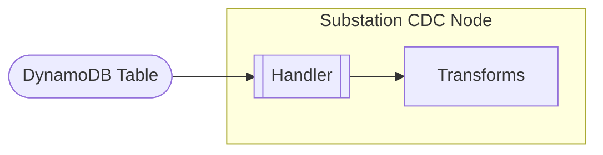
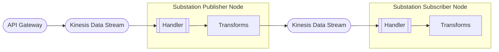
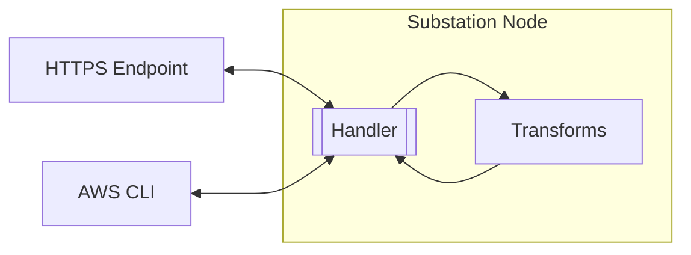
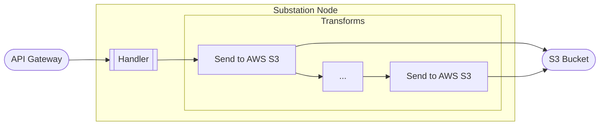
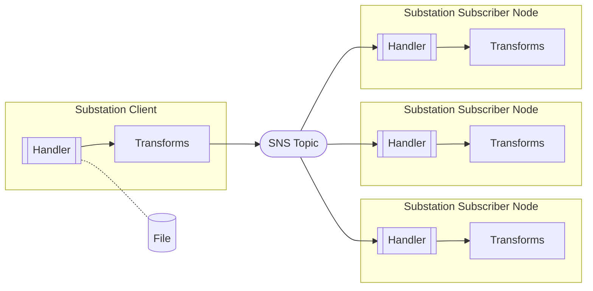
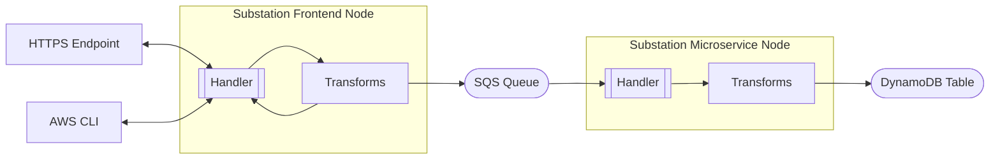

# AWS

These example deployments demonstrate different use cases for Substation on AWS. 

# DynamoDB

## Change Data Capture (CDC)

Deploys a data pipeline that implements a [change data capture (CDC) pattern using DynamoDB Streams](https://docs.aws.amazon.com/amazondynamodb/latest/developerguide/Streams.html).

# Kinesis

## Multi-Stream

Deploys a data pipeline that implements a multi-phase streaming data pattern using Kinesis Data Streams.

# Lambda

## Microservice

Deploys a synchronous microservice that performs DNS resolution. The service can be invoked [synchronously](https://docs.aws.amazon.com/lambda/latest/dg/invocation-sync.html) or using a [Lambda URL](https://docs.aws.amazon.com/lambda/latest/dg/lambda-urls.html). 

# S3

## Data Lake

Deploys a data pipeline that implements a data lake by writing raw and processed data to an S3 bucket.

# SNS

## Pub/Sub

Deploys a data pipeline that implements a [publish/subscribe (pub/sub) pattern](https://aws.amazon.com/what-is/pub-sub-messaging/). The application in `cmd/development/substation` can act as the client by reading a local file and sending its content to the SNS topic.

# SQS

## Microservice

Deploys an asynchronous microservice that performs DNS resolution. The service can be invoked [synchronously](https://docs.aws.amazon.com/lambda/latest/dg/invocation-sync.html) or using a [Lambda URL](https://docs.aws.amazon.com/lambda/latest/dg/lambda-urls.html) and results are stored in a DynamoDB table.

