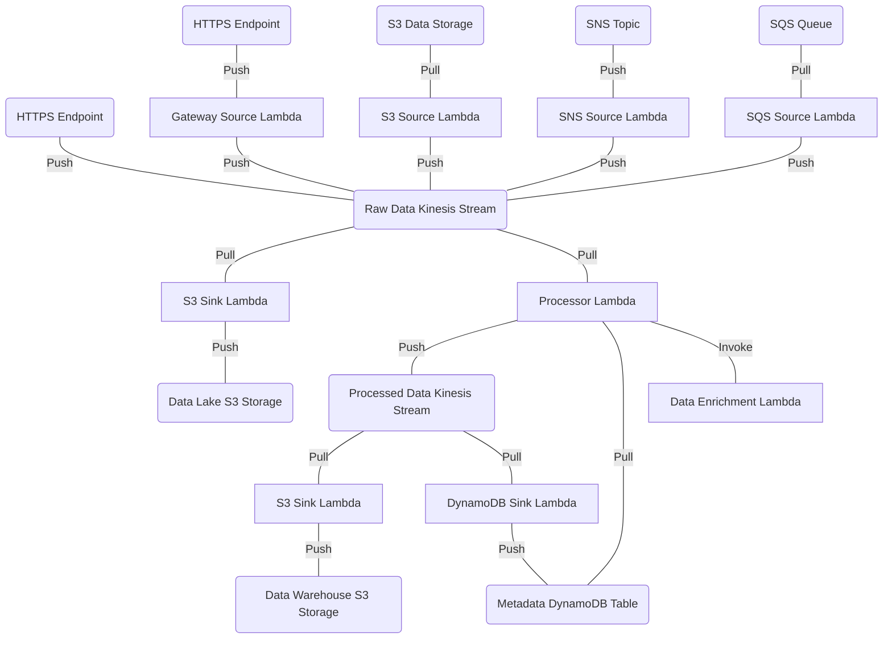

# aws

This example deploys a fully-featured data pipeline to AWS that makes use of every Substation component.

The data pipeline is visualized below:



## Deployment 

### Notes

* First time deployments will fail due to missing images in ECR
  + If this is a first time deployment, then ignore any Terraform errors related to Lambda + ECR invalid source images and work through step 6
* Lambda are deployed on the [arm64 architecture](https://docs.aws.amazon.com/lambda/latest/dg/foundation-arch.html)
  + If arm64 isn't preferred, then switch to the x86 architecture by changing the AWS_ARCHITECTURE environment variable and all Terraform Lambda architectures to `x86_64`
* ECR images are tagged `latest` -- we strongly recommend tagging production images with Substation's version number
  + `docker tag substation:latest-$AWS_ARCHITECTURE $AWS_ACCOUNT_ID.dkr.ecr.$AWS_REGION.amazonaws.com/substation:$(git describe --abbrev=0 --tags)`
* Large deployments require complex Terraform configurations, so we recommend the following naming convention: `[pipeline name]_[AWS service]_[sink|source|processor]_[short_description].tf`

### Step 0: Set Environment Variables

```bash
export SUBSTATION_ROOT=/path/to/repository
export AWS_ACCOUNT_ID=[AWS_ACCOUNT_ID]
export AWS_PROFILE=[AWS_PROFILE]
export AWS_REGION=[AWS_REGION]
export AWS_DEFAULT_REGION=$AWS_REGION
export AWS_ARCHITECTURE=arm64
```

### Step 1: Bootstrap the Infrastructure

```bash
cd $SUBSTATION_ROOT/examples/aws/terraform && \
terraform init && \
terraform apply
```

### Step 2: Build the Configurations

```bash
cd $SUBSTATION_ROOT && \
sh build/config/compile.sh
```

### Step 3: Upload the Configurations

```bash
cd $SUBSTATION_ROOT && \
SUBSTATION_CONFIG_DIRECTORY=examples/aws/ APPCONFIG_APPLICATION_NAME=substation APPCONFIG_ENVIRONMENT=prod APPCONFIG_DEPLOYMENT_STRATEGY=Instant python3 build/config/aws/appconfig_upload.py
```

### Step 4: Build the Containers

```bash
cd $SUBSTATION_ROOT && \
sh build/scripts/aws/lambda/get_appconfig_extension.sh && \
docker build --build-arg AWS_ARCHITECTURE=$AWS_ARCHITECTURE -f build/container/aws/lambda/substation/Dockerfile -t substation:latest-$AWS_ARCHITECTURE . && \
docker tag substation:latest-$AWS_ARCHITECTURE $AWS_ACCOUNT_ID.dkr.ecr.$AWS_REGION.amazonaws.com/substation:latest && \
docker build --build-arg AWS_ARCHITECTURE=$AWS_ARCHITECTURE -f build/container/aws/lambda/autoscaling/Dockerfile -t substation_autoscaling:latest-$AWS_ARCHITECTURE . && \
docker tag substation_autoscaling:latest-$AWS_ARCHITECTURE $AWS_ACCOUNT_ID.dkr.ecr.$AWS_REGION.amazonaws.com/substation_autoscaling:latest && \
docker images
```

### Step 5: Upload the Containers

```bash
cd $SUBSTATION_ROOT && \
sh build/scripts/aws/ecr_login.sh && \
docker push $AWS_ACCOUNT_ID.dkr.ecr.$AWS_REGION.amazonaws.com/substation:latest && \
docker push $AWS_ACCOUNT_ID.dkr.ecr.$AWS_REGION.amazonaws.com/substation_autoscaling:latest
```

### Step 6: Finish Deploying Infrastructure

```bash
cd $SUBSTATION_ROOT/examples/aws/terraform && \
terraform init && \
terraform apply
```

### Testing

* Upload data to the source S3 bucket
* HTTP POST data to the API Gateways
* Put records into the raw Kinesis stream
* Modify configurations and re-run steps 2 + 3

## config

These examples follow the best practices described in [config](/config/).

## terraform

### bootstrap.tf

This file acts as a deployment bootstrap and includes the following:

* creation of a deployment-wide KMS key
* creation of a deployment-wide AppConfig application with "prod" and "dev" environments
* creation of an "instant deployment" strategy for AppConfig
* creation of the AWS Lambda Substation ECR image repository
* creation of the AWS Lambda autoscaling ECR image repository

There are a few things to be aware of when running a fresh deployment:

* Terraform does not manage the build and deployment of container images; after the image repositories are created, then container build and upload should happen externally via Docker (see [build/container](/build/container/) for more information)
* Terraform does not manage the application configurations; after the AppConfig application is created, then hosted configurations should be compiled and uploaded (see [build/config](/build/config/) for more information)
  + As a best practice, we recommend using the "prod" environment for production data pipelines and the "dev" environment for development data pipelines
* "instant deployment" is useful for immediately deploying net-new data pipelines

### xray.tf

Substation Lambdas use AWS X-Ray for performance monitoring and tuning. If the AWS account's X-Ray data is not encrypted, then the `xray.tf` file can be used to setup encryption. The ARN produced by `xray_key` (or the ARN of a previously created encryption key) must be added as a kms_read and kms_write resources on all Lambda IAM policies. Alternatively, if no encryption is wanted, then exclude this file and any references to the `xray_key` ARN from Lambda IAM policies.

Read more about AWS X-Ray [here](https://aws.amazon.com/xray/).

### autoscaling.tf

This file includes everything required to deploy the AWS Lambda autoscaling application ( `cmd/aws/lambda/autoscaling` ). This is required for any data pipelines that use Kinesis Data Streams.

### example_appconfig.tf

IAM permissions for the Lambda to read from AppConfig.

### example_gateway_source.tf

API Gateway that writes data directly to the raw Kinesis stream.

### example_kinesis.tf

Kinesis streams and accompanying IAM permissions for reading and writing. 

### example_lambda_processor.tf

Lambda that reads from the raw Kinesis stream, processes data, and writes to the processed Kinesis stream.

### example_lambda_sink_dynamodb.tf

Lambda that reads from the processed Kinesis stream and writes data to DynamoDB.

### example_lambda_sink_processed_s3.tf

Lambda that reads from the processed Kinesis stream and writes data to S3.

### example_lambda_sink_raw_s3.tf

Lambda that reads from the raw Kinesis stream and writes data to S3.

### example_lambda_source_gateway.tf

API Gateway connected to a Lambda that writes data to the raw Kinesis stream.

### example_lambda_source_s3.tf

Lambda that reads from an S3 bucket data and writes data to the raw Kinesis stream.
