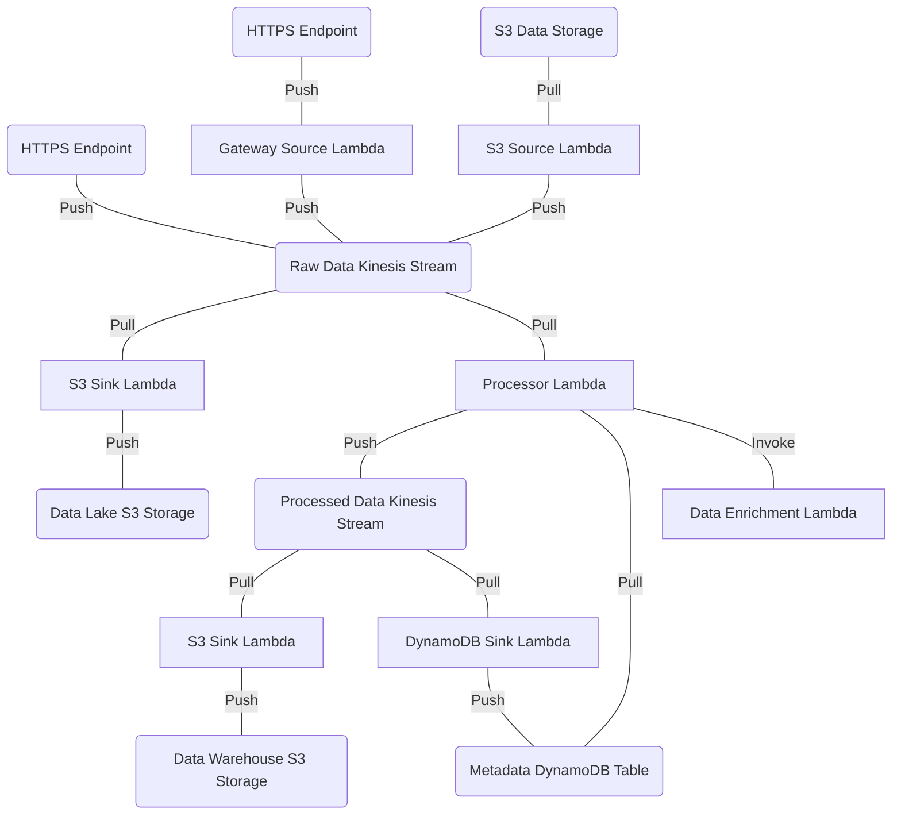

# aws

## config

These configs can be built and uploaded by executing the commands below from the project root:

- `sh build/config/compile.sh`
- `SUBSTATION_CONFIG_DIRECTORY=examples/aws/config APPCONFIG_APPLICATION_NAME=substation APPCONFIG_ENVIRONMENT=prod APPCONFIG_DEPLOYMENT_STRATEGY=Instant python3 build/config/aws/appconfig_upload.py`

These examples follow the best practices described in [config/](/config/).

## terraform

### bootstrap.tf

This file acts as a deployment bootstrap and includes the following:

- creation of a deployment-wide KMS key
- creation of a deployment-wide AppConfig application with "prod" and "dev" environments
- creation of an "instant deployment" strategy for AppConfig
- creation of the AWS Lambda Substation ECR image repository
- creation of the AWS Lambda autoscaling ECR image repository

There are a few things to be aware of when running a fresh deployment:

- Terraform does not manage the build and deployment of container images; after the image repositories are created, then container build and upload should happen externally via Docker (see [build/container/aws/](/build/container/aws/) for more information)
- Terraform does not manage the application configurations; after the AppConfig application is created, then hosted configurations should be compiled and uploaded (see [build/config/](/build/config/) for more information)
  - As a best practice, we recommend using the "prod" environment for production data pipelines and the "dev" environment for development data pipelines
- "instant deployment" is useful for immediately deploying net-new data pipelines

### xray.tf

Substation Lambdas use AWS X-Ray for performance monitoring and tuning. If the AWS account's X-Ray data is not encrypted, then the `xray.tf` file can be used to setup encryption. The ARN produced by `xray_key` (or the ARN of a previously created encryption key) must be added as a kms_read and kms_write resources on all Lambda IAM policies. Alternatively, if no encryption is wanted, then exclude this file and any references to the `xray_key` ARN from Lambda IAM policies.

Read more about AWS X-Ray [here](https://aws.amazon.com/xray/).

### autoscaling.tf

This file includes everything required to deploy the AWS Lambda autoscaling application (`cmd/aws/lambda/autoscaling`). This is required for any data pipelines that use Kinesis Data Streams.

### example_*.tf

These files include a fully-featured data pipeline that makes use of every Substation component as an example of a "best practice" deployment. This includes:

- ingest data from an S3 bucket
- ingest data from multiple API Gateways
- raw Kinesis stream for storage and access to unmodified, pre-processed data
- processed Kinesis stream for storage and access to transformed, processed data
- data processor Lambda that reads from the raw Kinesis stream, processes data, and writes to the processed Kinesis stream
- load raw data to an S3 bucket 
- load processed data to an S3 bucket
- load metadata to a DynamoDB table

This data pipeline can be visualized like this:

