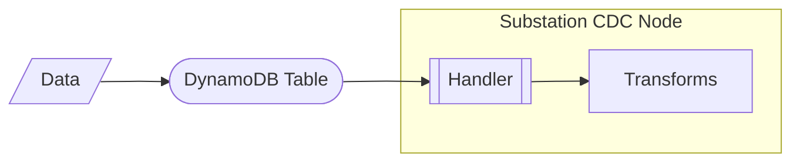

# dynamodb

Contains example deployments that focus on AWS DynamoDB.

## change data capture (cdc)

Deploys a Substation data pipeline that implements a [change data capture (CDC)](https://docs.aws.amazon.com/amazondynamodb/latest/developerguide/Streams.html) pattern using DynamoDB Streams.

The deployment is visualized below:

