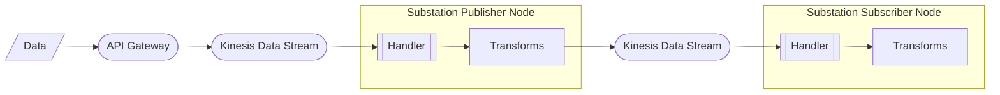

# kinesis

Contains example deployments that focus on AWS Kinesis.

## multistream

Deploys a Substation data pipeline that implements a multi-phase streaming data pattern using Kinesis Data Streams.

The deployment is visualized below:

