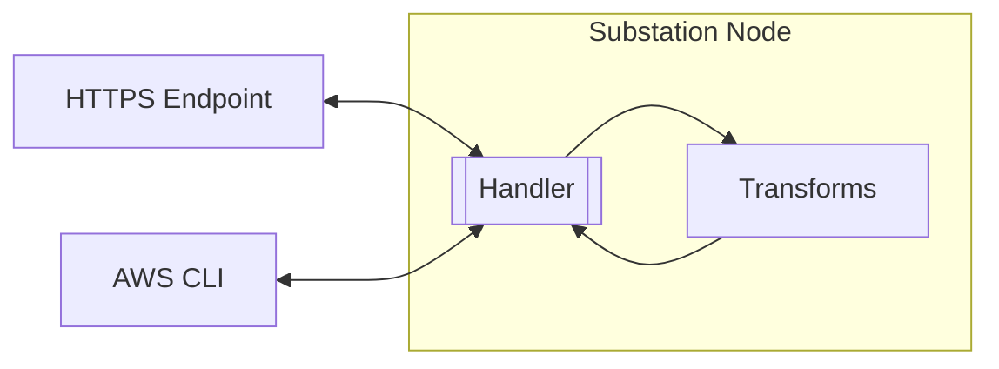

# lambda

Contains example deployments that focus on AWS Lambda.

## microservice

Deploys Substation as a synchronous microservice that performs DNS resolution. The service can be invoked [synchronously](https://docs.aws.amazon.com/lambda/latest/dg/invocation-sync.html) or using a [Lambda URL](https://docs.aws.amazon.com/lambda/latest/dg/lambda-urls.html). 

The deployment is visualized below:

