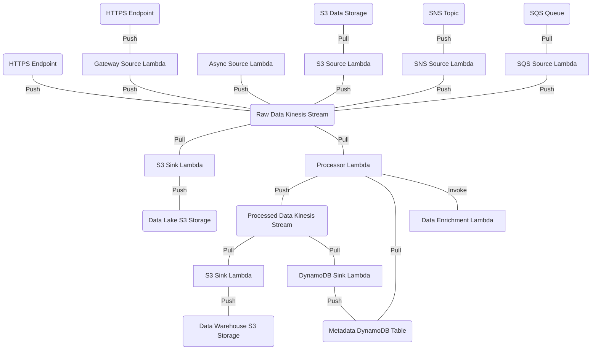

# pipeline

This example deploys a data pipeline to AWS that makes use of every Substation component.

The data pipeline is visualized below:

## Deployment 

See this recipe: https://substation.readme.io/recipes/deploying-example-aws-pipeline
