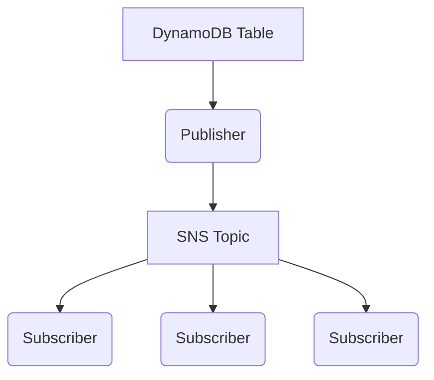

# pubsub

This example deploys a data pipeline that uses a [publish/subscribe (pub/sub) pattern](https://aws.amazon.com/what-is/pub-sub-messaging/). The publisher receives change data capture (CDC) events from a DynamoDB table and publishes them to an SNS topic from which three subscribers consume them.

The data pipeline is visualized below:

