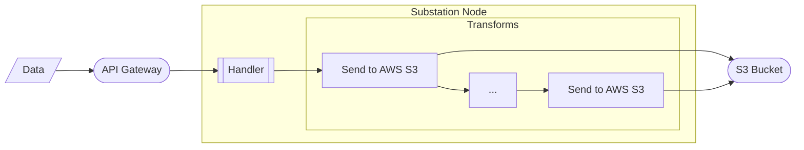

# s3

Contains example deployments that focus on AWS S3.

# microservice

Deploys a Substation data pipeline that implements a data lake by writing raw and processed data to an S3 bucket.

The service is visualized below:

