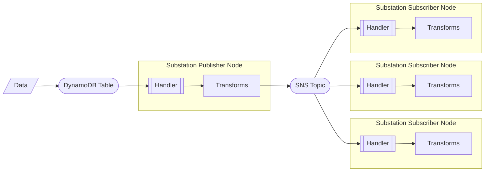

# sns

Contains example deployments that focus on AWS Simple Notification Service (SNS).

## pub_sub

Deploys a Substation data pipeline that implements a [publish/subscribe (pub/sub) pattern](https://aws.amazon.com/what-is/pub-sub-messaging/). DynamoDB Change Data Capture (CDC) events are published to and consumed from an SNS topic. 

The deployment is visualized below:

