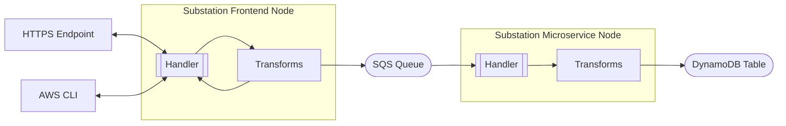

# sqs

Contains example deployments that focus on AWS SQS.

## microservice

Deploys Substation as an asynchronous microservice that performs DNS resolution. The service can be invoked [synchronously](https://docs.aws.amazon.com/lambda/latest/dg/invocation-sync.html) or using a [Lambda URL](https://docs.aws.amazon.com/lambda/latest/dg/lambda-urls.html) and results are stored in a DynamoDB table.

The deployment is visualized below:

