# AWS

These example deployments demonstrate different use cases for Substation on AWS.

# CloudWatch Logs

## Cross-Account / Cross-Region

Deploys a data pipeline that collects data from CloudWatch log groups in any account or region into a Kinesis Data Stream.

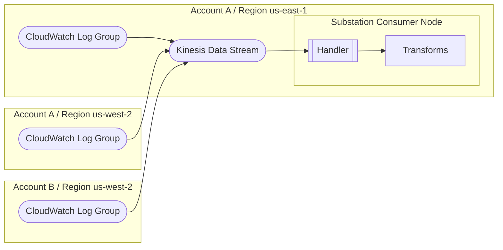

## To Lambda

Deploys a data pipeline that sends data from a CloudWatch log group to a Lambda function.

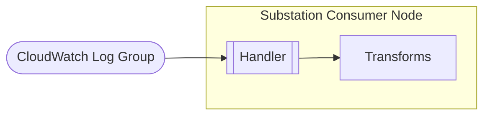

# DynamoDB

## Change Data Capture (CDC)

Deploys a data pipeline that implements a [change data capture (CDC) pattern using DynamoDB Streams](https://docs.aws.amazon.com/amazondynamodb/latest/developerguide/Streams.html).

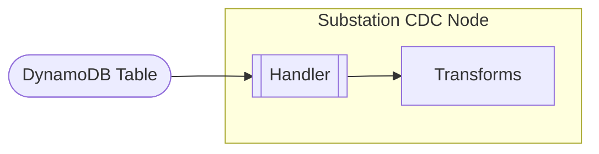

# Kinesis

## Firehose

Deploys a [Kinesis Data Firehose](https://aws.amazon.com/kinesis/data-firehose/) delivery stream with [data transformation](https://docs.aws.amazon.com/firehose/latest/dev/data-transformation.html) enabled.

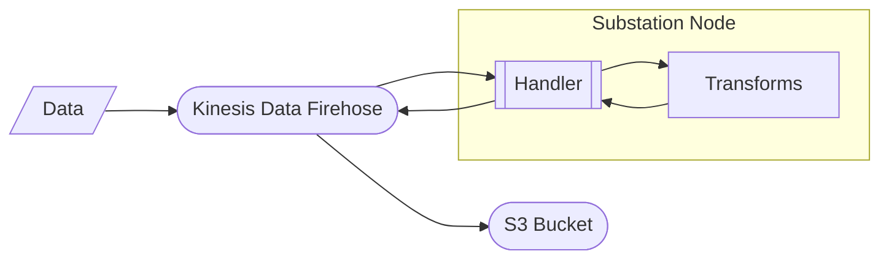

## Multi-Stream

Deploys a data pipeline that implements a multi-phase streaming data pattern using Kinesis Data Streams.

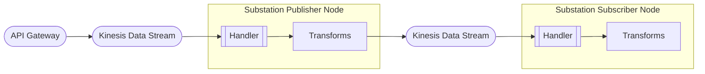

## Time Travel

Deploys a data pipeline that implements a "time travel" pattern by having a subscriber node read data more slowly than an enrichment node. The nodes share data observed across different events using a DynamoDB table.

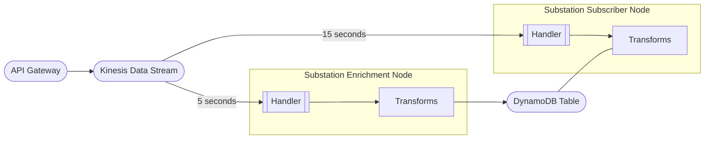

# Lambda

## Microservice

Deploys a synchronous microservice that performs DNS resolution. The service can be invoked [synchronously](https://docs.aws.amazon.com/lambda/latest/dg/invocation-sync.html) or using a [Lambda URL](https://docs.aws.amazon.com/lambda/latest/dg/lambda-urls.html). 

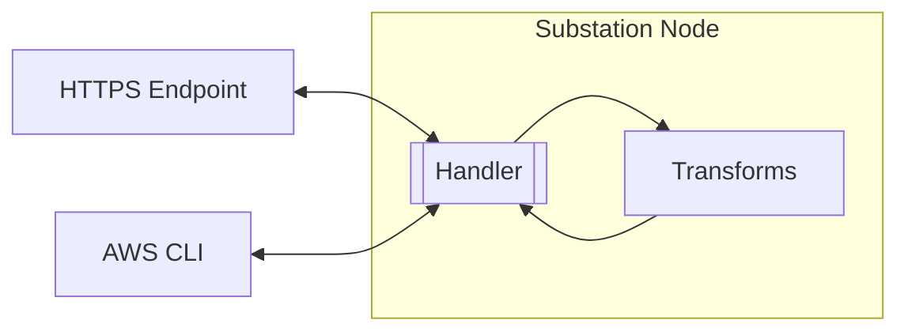

## VPC

Deploys a synchronous microservice in a VPC that returns the public IP address of the Lambda function. The Lambda can be invoked [synchronously](https://docs.aws.amazon.com/lambda/latest/dg/invocation-sync.html) or using a [Lambda URL](https://docs.aws.amazon.com/lambda/latest/dg/lambda-urls.html). This example can be used to validate how Substation transforms behave inside a VPC.

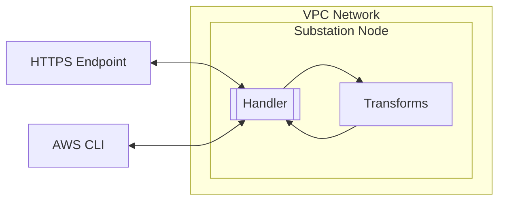

# S3

## Data Lake

Deploys a data pipeline that implements a [data lake pattern using S3](https://docs.aws.amazon.com/whitepapers/latest/building-data-lakes/amazon-s3-data-lake-storage-platform.html). The S3 bucket contains two copies of the data (original and transformed).

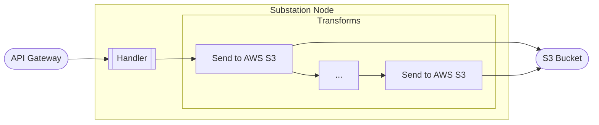

## SNS

Deploys a data pipeline that reads data from an S3 bucket via an SNS topic.

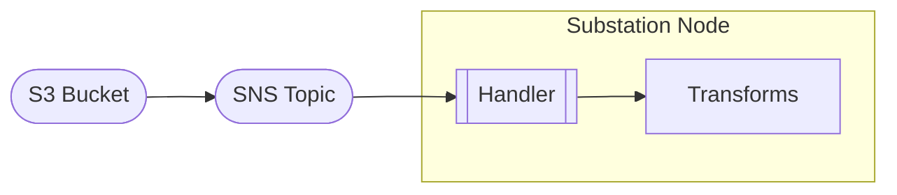

# SNS

## Pub/Sub

Deploys a data pipeline that implements a [publish/subscribe (pub/sub) pattern](https://aws.amazon.com/what-is/pub-sub-messaging/). The `examples/cmd/client/file` application can be used to send data to the SNS topic.

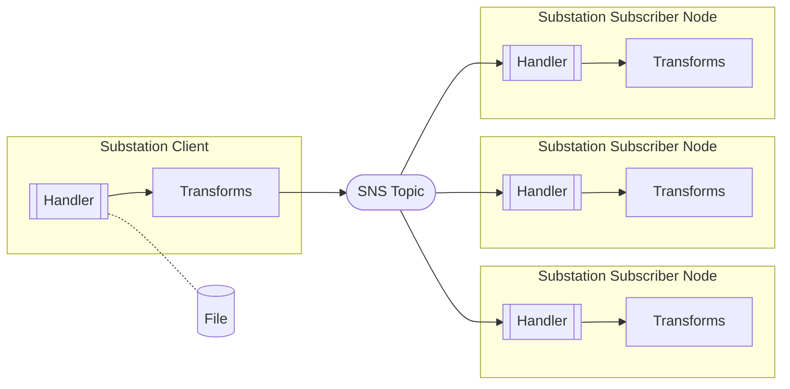

# SQS

## Microservice

Deploys an asynchronous microservice that performs DNS resolution. The service can be invoked [synchronously](https://docs.aws.amazon.com/lambda/latest/dg/invocation-sync.html) or using a [Lambda URL](https://docs.aws.amazon.com/lambda/latest/dg/lambda-urls.html); requests to the service are assigned a UUID that can be used to retrieve the result from the DynamoDB table.

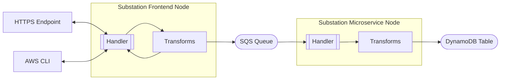
