# AWS

These example deployments demonstrate different use cases for Substation on AWS.

# CloudWatch Logs

## Cross-Account / Cross-Region

Deploys a data pipeline that collects data from CloudWatch log groups in any account or region into a Kinesis Data Stream.

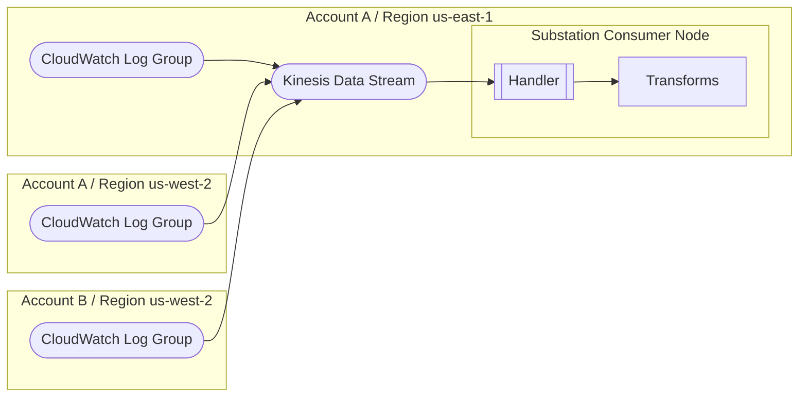

## To Lambda

Deploys a data pipeline that sends data from a CloudWatch log group to a Lambda function.

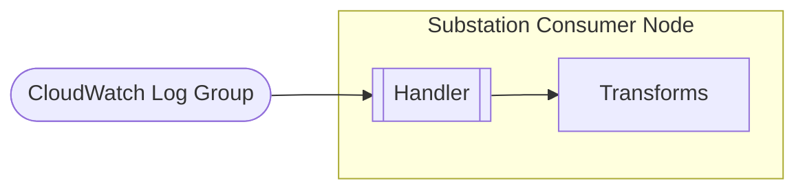

# DynamoDB

## Change Data Capture (CDC)

Deploys a data pipeline that implements a [change data capture (CDC) pattern using DynamoDB Streams](https://docs.aws.amazon.com/amazondynamodb/latest/developerguide/Streams.html).

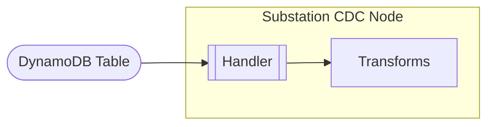

## Distributed Lock

Deploys a data pipeline that implements a distributed lock pattern using DynamoDB. This pattern can be used to add "exactly-once" semantics to services that otherwise do not support it. For similar examples, see the "exactly once" configurations [here](/examples/config/transform/meta/).

## Telephone

Deploys a data pipeline that implements a "telephone" pattern by sharing data as context between multiple Lambda functions using a DynamoDB table. This pattern can be used to enrich events across unique data sources.

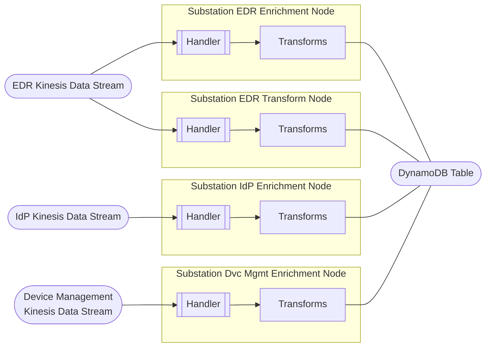

# EventBridge

## Lambda Bus

Deploys a data pipeline that sends data from an EventBridge event bus to a Lambda function.

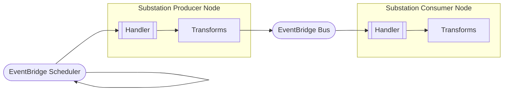

# Firehose

## Data Transform

Deploys a [Firehose](https://aws.amazon.com/firehose/) delivery stream with [data transformation](https://docs.aws.amazon.com/firehose/latest/dev/data-transformation.html) enabled.

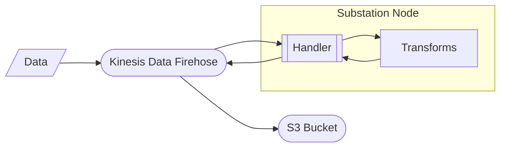

# Kinesis

## Autoscale

Deploys a Kinesis Data Stream with autoscaling enabled. This can also be used without Substation to manage Kinesis Data Streams.

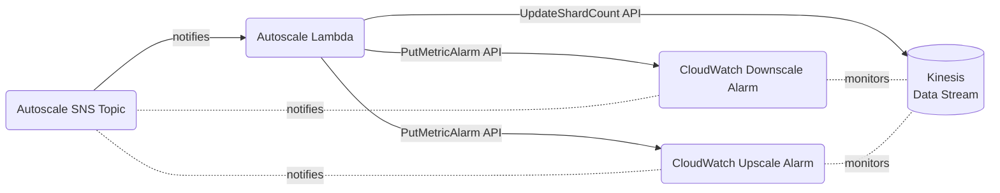

## Multi-Stream

Deploys a data pipeline that implements a multi-phase streaming data pattern using Kinesis Data Streams.

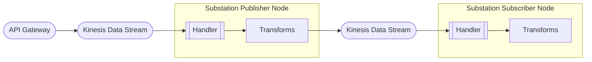

## nXDR

Deploys a data pipeline that implements an nXDR pattern by applying threat / risk enrichment metadata to events and sending the enriched data to multiple destinations. This pattern is useful for:
- Generating risk-based detection rules
- Guiding analysts during incident investigations and incident response
- Aiding unstructured threat hunts
- Priorizing logs for retention and analysis

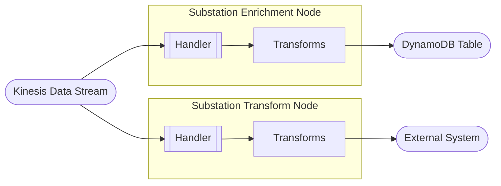

## Time Travel

Deploys a data pipeline that implements a "time travel" pattern by having a subscriber node read data more slowly than an enrichment node. The nodes share data observed across different events using a DynamoDB table.

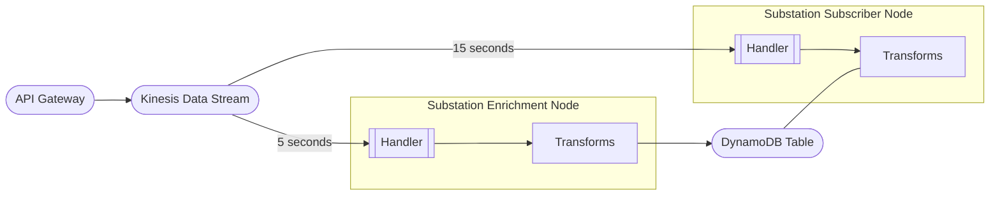

# Lambda

## AppConfig

Deploys a data pipeline with an invalid config that triggers AppConfig's validator feature. When the AppConfig service receives the compiled Substation configuration and attempts to deploy, the deployment will fail and return an error.

## Microservice

Deploys a synchronous microservice that performs DNS resolution. The service can be invoked [synchronously](https://docs.aws.amazon.com/lambda/latest/dg/invocation-sync.html) or using a [Lambda URL](https://docs.aws.amazon.com/lambda/latest/dg/lambda-urls.html). 

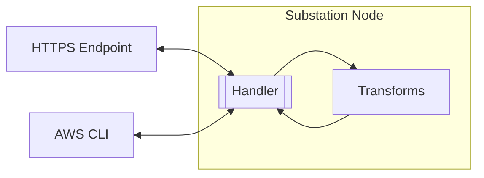

## VPC

Deploys a synchronous microservice in a VPC that returns the public IP address of the Lambda function. The Lambda can be invoked [synchronously](https://docs.aws.amazon.com/lambda/latest/dg/invocation-sync.html) or using a [Lambda URL](https://docs.aws.amazon.com/lambda/latest/dg/lambda-urls.html). This example can be used to validate how Substation transforms behave inside a VPC.

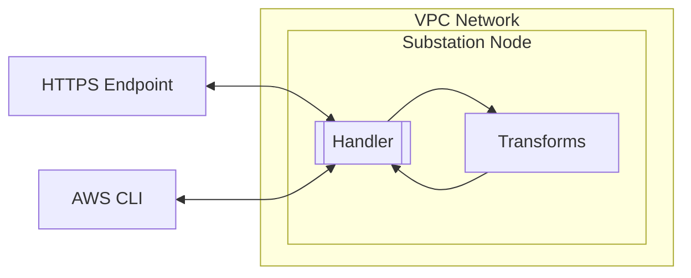

# S3

## Data Lake

Deploys a data pipeline that implements a [data lake pattern using S3](https://docs.aws.amazon.com/whitepapers/latest/building-data-lakes/amazon-s3-data-lake-storage-platform.html). The S3 bucket contains two copies of the data (original and transformed).

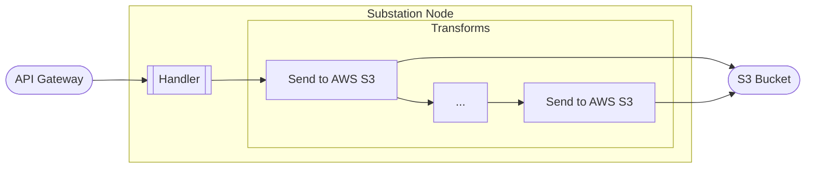

## Retry on Failure

Deploys a data pipeline that reads data from an S3 bucket and automatically retries failed events using an SQS queue as a [failure destination](https://aws.amazon.com/blogs/compute/introducing-aws-lambda-destinations/). This example will retry forever until the error is resolved.

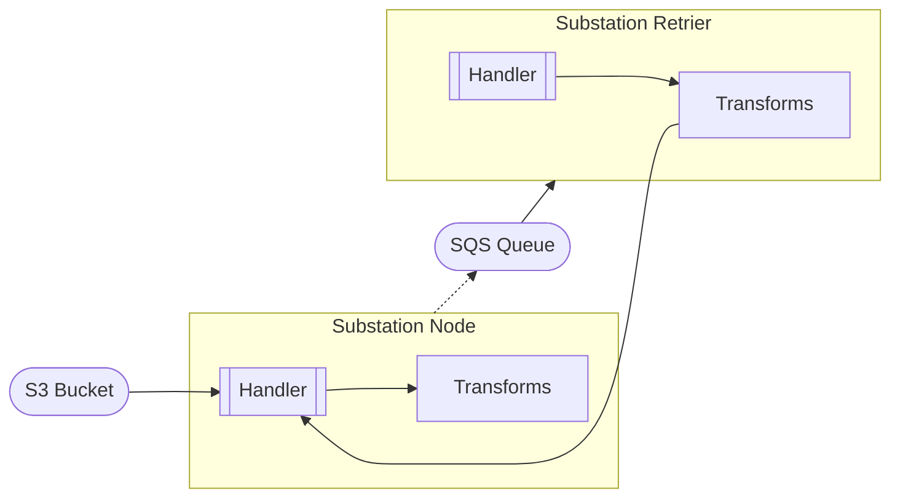

## SNS

Deploys a data pipeline that reads data from an S3 bucket via an SNS topic.

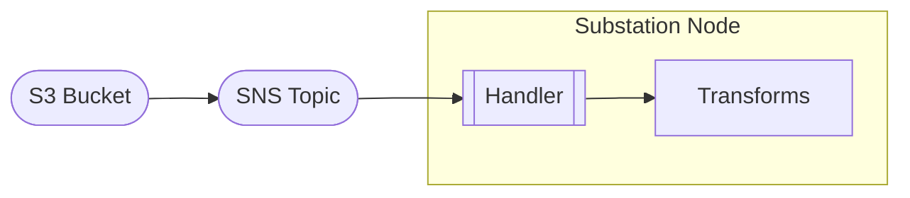

## XDR

Deploys a data pipeline that implements an XDR (extended detection and response) pattern by reading files from an S3 bucket, conditionally filtering and applying threat / risk enrichment metadata to events, and then writing the enriched events to an S3 bucket. The S3 bucket contains two copies of the data (original and transformed).

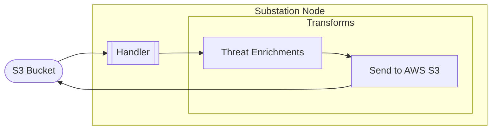

# SNS

## Pub/Sub

Deploys a data pipeline that implements a [publish/subscribe (pub/sub) pattern](https://aws.amazon.com/what-is/pub-sub-messaging/). The `examples/cmd/client/file` application can be used to send data to the SNS topic.

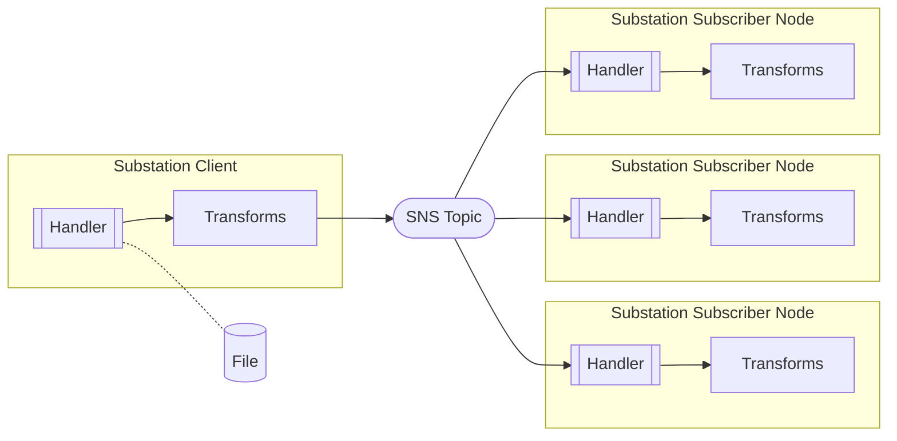

# SQS

## Microservice

Deploys an asynchronous microservice that performs DNS resolution. The service can be invoked [synchronously](https://docs.aws.amazon.com/lambda/latest/dg/invocation-sync.html) or using a [Lambda URL](https://docs.aws.amazon.com/lambda/latest/dg/lambda-urls.html); requests to the service are assigned a UUID that can be used to retrieve the result from the DynamoDB table.

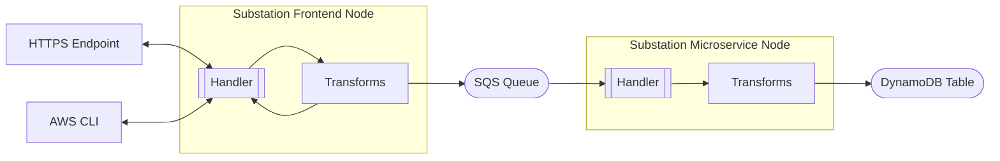
